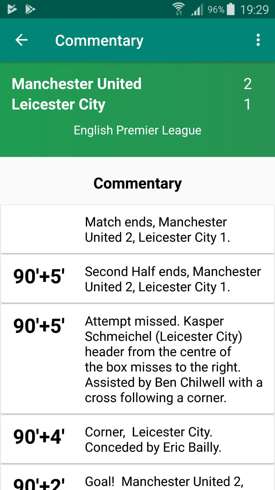
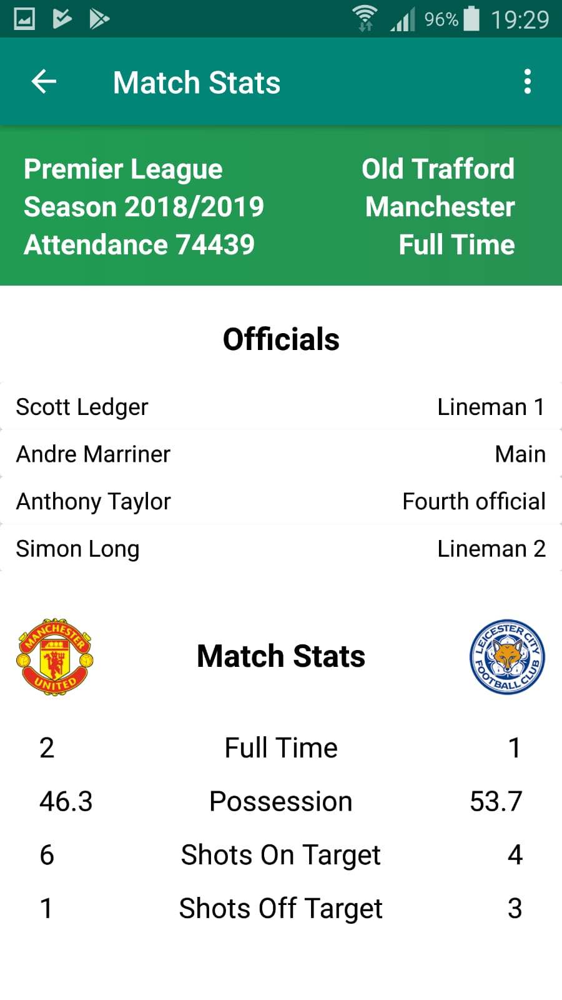
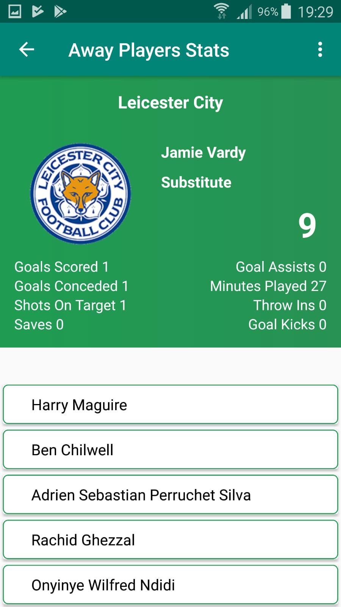
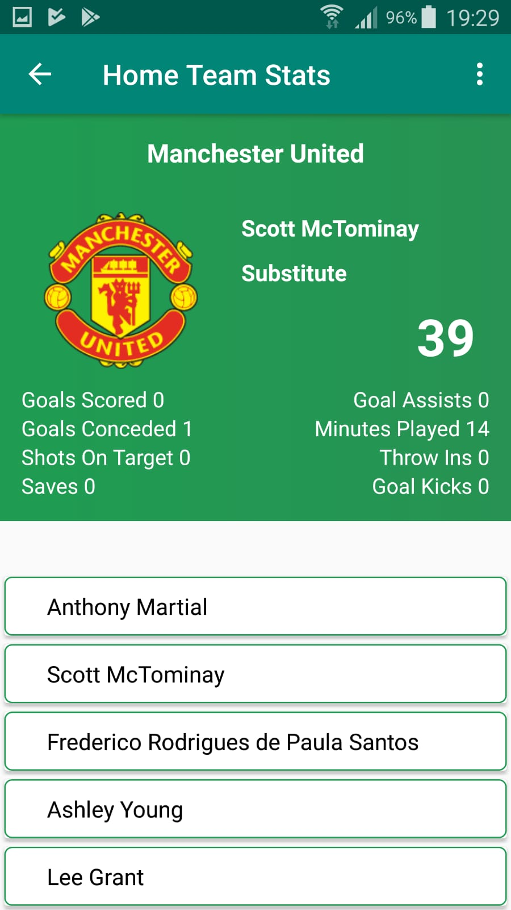

# Football App - Android Application
- Built using Java
- Android Studio
- Restful API in JSON Format
- This application displays in game football commentary and player stats by downloading data from API
- API not included in this demo
- MVC Design Pattern
- XML

# Screenshots of Application

 

 
